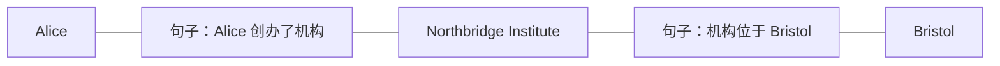

# 如何理解 LinearRAG 算法？

读一篇检索论文，很容易记住几个名字，却忘记它们为什么要放在一起。实体、句子、向量、传播、PageRank，各自似乎都能解释，连起来却还是模糊的。要恢复对 LinearRAG 的理解，可以先把这些名字放在一边，想象一件具体的事：答案分散在两段材料里，怎样把它们一起找回来？

这一章沿着这个问题走。先看材料，再看联系，最后把已经理解的动作对应到论文公式。下一章会继续使用同一份材料，去看官方代码怎样执行这些动作。

## 1. 找答案时，为什么“找相似的文字”有时还不够？

假设资料库里只有下面三段英文。人物、机构和事件都是为讲解编造的；使用英文，是为了与项目中的英文实体识别和嵌入流程保持一致。

| 段落 | 原文 | 大意 |
|---|---|---|
| P0 | Alice founded Northbridge Institute. | Alice 创办了 Northbridge Institute。 |
| P1 | Northbridge Institute is located in Bristol. | Northbridge Institute 位于 Bristol。 |
| P2 | Alice visited Paris during a summer holiday. | Alice 曾在暑假去过 Paris。 |

问题是：

> In which city is the institute founded by Alice located?

也就是：Alice 创办的机构位于哪座城市？

人读完这三段，很快就能把 P0 和 P1 接起来。先从 P0 知道机构的名字，再去 P1 找所在地。P2 同时有人名和城市，表面上也贴近问题，但旅游地点没有回答机构所在地。

直接向量检索会把问题和每个段落编码成向量，根据相似度选材料。这是一条很有用的起步路线：如果某段直接讲清了答案，它很可能就能被找到。困难在于，这里的 P1 没有出现 Alice，问题里又没有出现 Northbridge Institute。人能在阅读中补出的中间名字，检索器在第一眼比较时还没有。

这个例子没有实际运行嵌入模型，所以不能据此断言向量检索一定漏掉 P1。它帮助看见的是一种需求：检索应当有机会沿着 P0 找到 Northbridge Institute，再利用这个名字找到 P1，而不完全依赖问题与 P1 的直接相似度。

LinearRAG 就是在给检索增加这种寻找机会。

## 2. 文本里有哪些联系值得留下？

为了沿着材料找下去，系统需要先知道哪些名字出现在什么地方。

在这个例子里，可以把 Alice、Northbridge Institute、Bristol、Paris 看作实体。实体是文本中的连接点：同一个名字出现在不同材料里，就提供了把材料接起来的机会。句子保留具体表达，段落保留最终交给回答模型阅读的上下文。

三种粒度各有用途。段落适合承载完整材料，但有时包含多件事；句子更容易集中表达一个局部线索；实体让这些局部线索有了共同的入口。这里每段只有一句话，是为了方便观察。实际语料中，一个段落可以包含多个句子和多个实体。

论文将这些对象组织为 Tri-Graph，记录两类联系：句子提到了哪个实体，段落包含哪个实体。例如：



这张图画的是句子与实体之间的提及联系。图上没有提前写好“创办”“位于”两种关系标签，它们的意思仍然保留在原句里。检索时再结合问题，判断哪句值得走过去。最终回答时，模型阅读原段落，解释其中的具体关系。

为什么采用这种安排？因为先把全文抽成关系三元组，需要额外的抽取工作，也可能丢失否定、条件和上下文。LinearRAG 选择保留原文，通过实体把材料连起来，将关系的具体含义留到使用文本时理解。这是论文提出的设计理由。

这也解释了论文中的 token-free：建图不需要调用生成式 LLM 来抽取关系。NER 和嵌入模型仍然需要处理文本、执行计算；后面的答案生成也仍然可以调用 LLM。理解它省掉了哪一项工作，比把它记成“整个系统没有成本”更有用。

保留原文同样不保证一定找得到原文。名字没被识别出来、别名没对齐、相似度判断偏了，都可能影响连通和选择。材料还在，访问材料的路线仍然可能有缺口。

## 3. 问题来了，第一步从哪里找起？

读者已经知道 Northbridge Institute 是关键中间点，系统开始检索时还不知道。它先对问题做实体识别，再把识别出的名字与索引中的实体匹配。

为了继续讲解，假设问题识别出了 Alice，语料中的四个实体也都被识别并保存。这里的识别结果是教学假设，实际输出取决于 NER 模型。

系统把问题中的 Alice 编码成向量，在已有实体向量中寻找最相似的一个。被选中的语料实体成为种子，相似度成为起始分数。这样做允许名称表达存在一定差异，也带来一个需要注意的地方：最相似的候选并不自动等于正确对象。

种子提供了出发点，但还需要问题本身来指路。Alice 关联着 P0 中的创办句子，也关联着 P2 中的旅游句子。这两句都提到了她，只有“是否与当前问题相关”的信号，才能帮助系统选择方向。因此，系统还要比较整个问题与句子的语义相似度。

此时有两种不同的分数：实体匹配分数说明起点有多可靠，问题与句子的相似度说明经过这句话有多值得。后面的传播会把这两种信号结合起来。

## 4. 怎样从眼前的线索找到下一条线索？

从 Alice 出发，找到提到她的句子。假如创办句子与问题更相关，系统就可以经由这句话发现 Northbridge Institute。机构得到分数后，又成为下一轮的出发点，进而访问介绍其所在地的句子。

可以把这段过程读成：

```text
Alice → 创办句子 → Northbridge Institute → 所在地句子 → Bristol
```

这条路线表示希望利用的联系。真实程序是否走完，要看句子相似度、剪枝规则和迭代次数。它也可能同时访问其他分支。

先用一组手工数字体会分数的作用。假设种子分数为 0.9，创办句子的相似度为 0.8，那么沿这句话传播的一项分数可以是 0.9 × 0.8 = 0.72。如果下一句的相似度还是 0.8，继续传播得到 0.72 × 0.8 = 0.576。这只是单条路径上的乘法示意，数值没有来自模型；论文中多个邻居的贡献还会聚合，官方 BFS 的具体处理将在下一章说明。

为何要剪枝？因为一个常见实体可能连接许多句子。每次都走遍所有联系，既增加工作，也容易把不相关的人名、地名继续扩展开来。阈值给了一个简单约束：分数太低的线索不继续走。阈值高，路线收得更紧；阈值低，留下更多机会，也留下更多偏离问题的可能。

迭代次数限制走多远。一次实体到句子再到实体的传播，可以发现一批新的连接点；多走几轮，就有机会触及更远的材料。当已经没有值得继续传播的线索时，过程可以提前结束。

这里发生的是检索线索的扩展。句子“与问题相似”和句子“确实证明了某个关系”之间仍有距离。LinearRAG 用前者帮助找到材料，回答模型再利用原文处理后者。

## 5. 找到了许多线索，怎样选出最终的段落？

经过传播，系统手里有了一组与问题有关的实体。接下来要选的是段落，因为回答模型需要能够阅读的材料。

论文把这一步放到实体与段落的联系上。Northbridge Institute 同时出现在 P0 和 P1 中，这使得两段都能接收到来自机构实体的信号。问题与段落的直接相似度也仍然有用：某些材料虽然实体线索少，却可能直接解释问题。

因此，段落的起始分数同时考虑两件事：它与问题有多相似，它包含的已激活实体能提供多少支持。实体在段落中的出现次数和传播层级也会参与计算。使用对数，让重复出现带来的加分增长得缓一些；按层级折减，则让较远线索的贡献受到约束。

这些起始分数随后交给个性化 PageRank。可以想象一个不断在图上移动的读者：有时沿着现有联系走到邻居，有时重新回到与问题有关的起点。与问题相关的实体和段落，更容易成为重新出发的位置；图上的连接又让这份关注分配到其他节点。反复分配后，得到最终排序。

为什么已有起始分数，还要走这一步？在例子里，机构实体把 P0 和 P1 接在一起。起始分数给每个节点一份各自的判断，图上的分配则让共享线索继续影响彼此。P1 即使与问题的直接相似度不突出，也有机会因机构这一连接受到更多关注。同样，连接到干扰材料的边也可能带来无关信号，所以图排序是否有帮助，需要实际观察。

“个性化”就在重新出发的位置里。同一张图，换一个问题，起点权重就会改变，段落排名也会随之改变。damping 控制沿图继续走与重新出发的比例，它影响线索在图上扩散的程度。

排序结束后取 Top-k 段落，作为回答上下文。这个过程不要求答案词必须先被激活成实体。在例子里，只要 P1 被选进上下文，回答模型就有机会从原句读出 Bristol；即使传播没有继续激活 Bristol，也不等于检索失败。项目中的真实案例可以帮助理解这一点，见第一部分的[消融与案例分析](../report/mechanisms.md)。

## 6. 回到论文，读懂公式与完整流程

现在再读公式，每个符号都可以找到前面对应的对象。设有 P 个段落、S 个句子、E 个实体。

公式 (1) 的 contain matrix 是段落到实体的表：

$$
C\in\{0,1\}^{P\times E},\qquad C_{ij}=\mathbf{1}[p_i\text{ 包含 }e_j]
$$

公式 (2) 的 mention matrix 是句子到实体的表：

$$
M\in\{0,1\}^{S\times E},\qquad M_{ij}=\mathbf{1}[s_i\text{ 提到 }e_j]
$$

按照 Alice、Northbridge Institute、Bristol、Paris 的列顺序，例子中的 M 可以写成：

$$
M=\begin{bmatrix}
1&1&0&0\\
0&1&1&0\\
1&0&0&1
\end{bmatrix}
$$

第一行把 Alice 与机构放在同一句中，第二行把机构与 Bristol 放在同一句中。由于例子每段恰好只有一句，C 在这里与 M 相同；一般语料不具备这个条件。

公式 (3) 得到实体起始分数向量 a：它有 E 项，种子所在的位置有匹配分数，其余位置从零开始。公式 (4) 得到问题与句子的相似度向量 σ：它有 S 项，每项对应一个句子。

公式 (5) 把“实体到句子，再到实体”写成了一次更新：

$$
a^{(t)}=\operatorname{MAX}\left(M^T\left(\sigma\odot(Ma^{(t-1)})\right),\ a^{(t-1)}\right)
$$

先看内层：M a 把 E 项实体分数变成 S 项句子分数，表示这些句子接到了多少实体信号。再逐项乘上 σ，让问题与句子的相关程度参与筛选。最后乘 M 的转置，把句子信号送回 E 项实体。MAX 逐项保留新聚合值与旧值中较大的那个。

矩阵方向由这些对象决定：句子 × 实体的 M 乘实体向量，输出句子向量；实体 × 句子的 M 转置乘句子向量，输出实体向量。先辨认“现在手里是什么，要变成什么”，就容易理解为什么要转置。

公式 (6) 描述图上重要性通过邻居分配的递推。论文文字进一步指定了问题相关的实体和段落初始信号；官方代码通过 PPR 的 reset 参数提供这些信号。仅看公式 (6) 展示的常数项，还不足以看清问题怎样进入个性化排序，这一点要与下一章的实际调用一起读。

公式 (7) 定义段落初始权重：

$$
I_0(p)=\left[\lambda\,\operatorname{sim}(q,p)+\ln\left(1+\sum_{e\in E_a}\frac{a_e\ln(1+N_{e,p})}{L_e}\right)\right]W_p
$$

λ 调整直接段落相似度的贡献；a 是激活实体的分数；N 是该实体在当前段落的出现次数；L 是传播层级；W 是段落节点的权重系数。I₀ 在这里用来明确表示起始权重，最终排名还要经过 PPR。

把它们连起来，就是：先从语料保存实体、句子、段落及联系；问题到来后找种子，用相关句子扩展实体；把实体信号和段落相似度一起交给图排序；取回原段落，再生成答案。

论文将建图的线性扩展与省去关系抽取作为效率上的理由。理解这个设计，可以先想到：增加材料时，需要处理新增文本和它产生的联系。实际速度还取决于文本长度、NER、编码、图计算和硬件；一次本地测量不能证明所有规模下的复杂度或速度。现有测量放在[效率与规模](../report/cost.md)，这里保留的是方法为何可能节省工作量的认识。

本章依据仓库内的 [LinearRAG 论文](../../../LinearRAG.pdf)第 3 节、图 3 与公式 (1)–(7)。下一章会把这些动作对应到[实际代码](implementation.md)，包括矩阵表达与默认 BFS 的差别。
