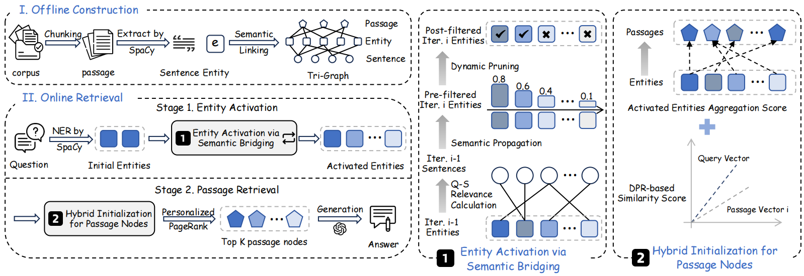
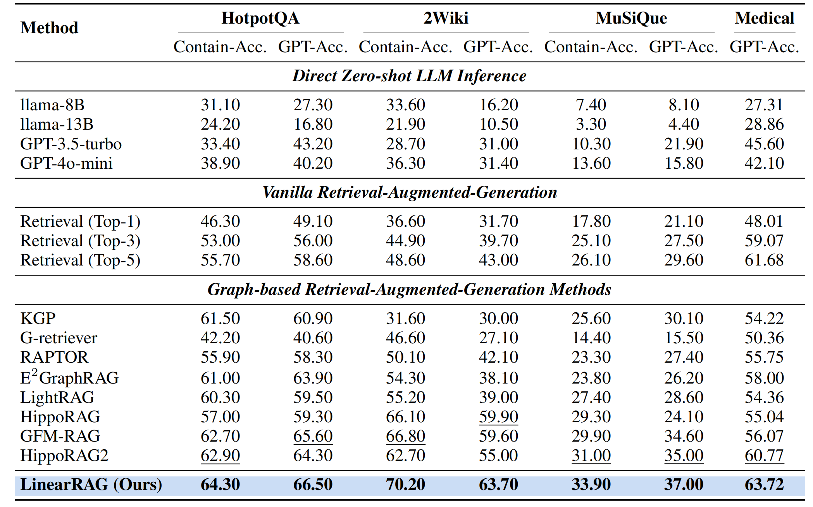

# **LinearRAG：面向大规模语料库的线性图检索增强生成**

> 一种面向高效 GraphRAG 的无关系图构建方法。它在图构建阶段不消耗大语言模型令牌，使 GraphRAG 更快速、更高效。

<p align="center">
  <a href="https://arxiv.org/abs/2510.10114" target="_blank"></a>
  <a href="https://huggingface.co/datasets/Zly0523/linear-rag/tree/main" target="_blank"></a>
  <a href="https://github.com/LuyaoZhuang/linear-rag" target="_blank"></a>
</p>

---

## 🎉 **动态**

- **[2026-05-17]** 用于记忆增强 RAG 的 **[MemGraphRAG](https://github.com/XMUDeepLIT/MemGraphRAG)** 被 KDD 2026 接收。
- **[2026-04-07]** 用于提升 RAG 忠实性的 **[ProbeRAG](https://github.com/LinfengGao/ProbeRAG.git)** 被 ACL 2026 接收。
- **[2026-04-07]** 用于可靠智能体搜索的 **[BAPO](https://github.com/Liushiyu-0709/BAPO-Reliable-Search.git)** 被 ACL 2026 接收。
- **[2026-04-07]** 用于可靠法律推理的 **[LegalGraphRAG](https://github.com/XMUDeepLIT/LegalGraphRAG.git)** 被 ACL 2026 接收。
- **[2026-04-07]** GraphRAG 攻击模型 **[LogicPoison](https://github.com/Jord8061/logicPoison.git)** 被 ACL 2026 接收。
- **[2026-01-26]** 用于高效 GraphRAG 的 **[LinearRAG](https://github.com/DEEP-PolyU/LinearRAG)** 被 ICLR 2026 接收。
- **[2026-01-26]** **[GraphRAG Benchmark](https://github.com/GraphRAG-Bench/GraphRAG-Benchmark)** 被 ICLR 2026 接收。
- **[2025-11-08]** **[LogicRAG](https://github.com/chensyCN/LogicRAG.git)** 被 AAAI 2026 接收。
- **[2025-10-27]** 发布无关系图构建方法 **[LinearRAG](https://github.com/DEEP-PolyU/LinearRAG)**。
- **[2025-06-06]** 发布用于评估 GraphRAG 模型的 **[GraphRAG Benchmark](https://github.com/GraphRAG-Bench/GraphRAG-Benchmark.git)**。
- **[2025-05-14]** 发布 [GraphRAG Benchmark 数据集](https://huggingface.co/datasets/GraphRAG-Bench/GraphRAG-Bench)。
- **[2025-01-21]** 发布 [GraphRAG 综述](https://github.com/DEEP-PolyU/Awesome-GraphRAG)。

---

## 🚀 **特点**

- ✅ **保留上下文**：采用无关系图构建方式，依靠轻量级实体识别和语义连接实现全面的上下文理解。
- ✅ **复杂推理**：通过语义桥接支持深层检索，在一次检索中完成多跳推理，无需显式关系图。
- ✅ **高扩展性**：不消耗大语言模型令牌，构建速度更快，时间和空间复杂度均为线性。

<p align="center"></p>

---

## 🛠️ **使用方法**

### 1️⃣ 安装依赖

**步骤 1：安装 Python 包**

```bash
pip install -r requirements.txt
# 建议使用 Python 3.9
```

**步骤 2：下载 spaCy 语言模型**

```bash
python -m spacy download en_core_web_trf
```

> **说明：** 对于 `medical` 数据集，需要安装科学和生物医学领域的 spaCy 模型：

```bash
pip install https://s3-us-west-2.amazonaws.com/ai2-s2-scispacy/releases/v0.5.3/en_core_sci_scibert-0.5.3.tar.gz
```

**步骤 3：配置 OpenAI API 密钥**

```bash
export OPENAI_API_KEY="your-api-key-here"
export OPENAI_BASE_URL="your-base-url-here"
```

**步骤 4：下载数据集**

从 Hugging Face 下载数据集，并将其放入 `dataset/` 目录：

```bash
git clone https://huggingface.co/datasets/Zly0523/linear-rag
cp -r linear-rag/* dataset/
```

**步骤 5：准备嵌入模型**

确保嵌入模型位于：

```text
model/all-mpnet-base-v2/
```

### 2️⃣ 快速开始示例

```bash
SPACY_MODEL="en_core_web_trf"
EMBEDDING_MODEL="model/all-mpnet-base-v2"
DATASET_NAME="2wikimultihop"
LLM_MODEL="gpt-4o-mini"
MAX_WORKERS=16

python run.py \
    --spacy_model ${SPACY_MODEL} \
    --embedding_model ${EMBEDDING_MODEL} \
    --dataset_name ${DATASET_NAME} \
    --llm_model ${LLM_MODEL} \
    --max_workers ${MAX_WORKERS}
    # 可选：使用基于向量化矩阵的 GPU 加速检索；GPU 性能不足时使用 BFS 迭代。
    # --use_vectorized_retrieval
```

## 🎯 **性能**

<div align="center">


## 📬 引用

如果本项目对你的研究有所帮助，请引用：

```bibtex
@article{zhuang2025linearrag,
  title={LinearRAG: Linear Graph Retrieval Augmented Generation on Large-scale Corpora},
  author={Zhuang, Luyao and Chen, Shengyuan and Xiao, Yilin and Zhou, Huachi and Zhang, Yujing and Chen, Hao and Zhang, Qinggang and Huang, Xiao},
  journal={arXiv preprint arXiv:2510.10114},
  year={2025}
}
```
